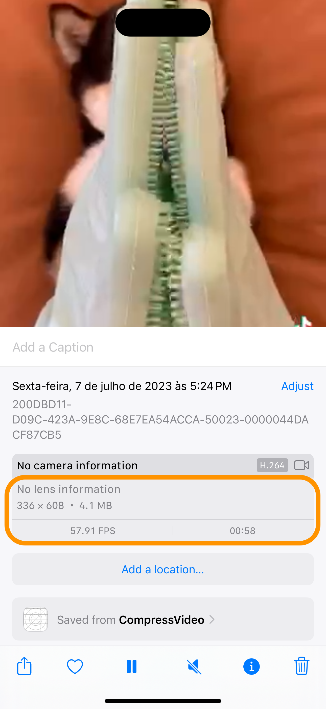

# Compress Video

Aplicación para comprimir vídeos, utilizando el paquete `LightCompressor`. 
La aplicación se desarrollo con Xcode 15 para probar nuevas funcionalidades, entre ellas __String Catalog__ para múltiples idiomas.  

## Ejemplo

## Comparación

| Sin comprimir | Comprimido |
|---------------|------------|
|  |  |
